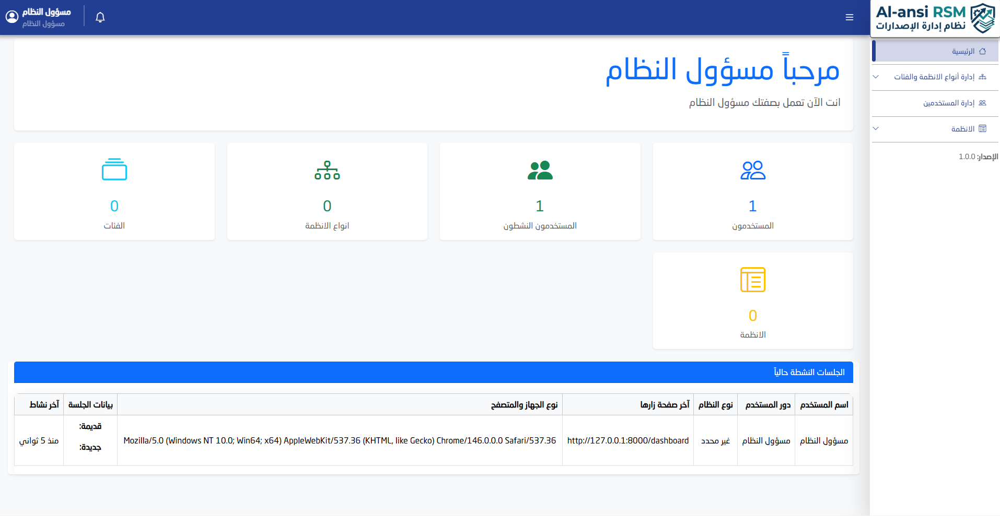
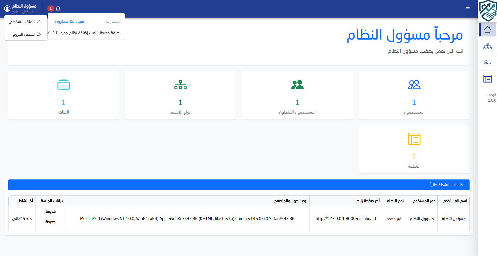

# RSM - Release Management System

A professional Release Management System designed to simplify and control software version distribution for clients and internal teams.

---

## 📌 Project Overview

RSM is a web-based system built to manage software releases efficiently.  
It allows organizations to upload, organize, and distribute different versions of their systems in a secure and structured way.

The system ensures controlled access to releases based on user roles and permissions.

---

## 🚀 Key Features

- Multi-user system with role-based access control (RBAC)
- Customizable permissions for each user type
- Upload and manage software versions and release files
- Direct download of system releases
- Generate secure **one-time download links**
- Automatic expiration of links after first use
- Simplified deployment process for clients

---

## 🛠 Technologies Used

- PHP
- Laravel Framework
- Livewire (for dynamic frontend components)
- MySQL
- HTML / CSS / JavaScript

---

## 🔐 Security Features

- Role-based access control
- Restricted file access based on permissions
- One-time download links for sensitive releases
- Controlled distribution of system versions

---

## 📦 How It Works

1. Admin uploads a new system version
2. Users with permissions can access available releases
3. System generates secure download links
4. Links can be configured for single-use access
5. Files are downloaded securely without exposing direct paths

---

## 📸 Screenshots

Screenshots of the system are attached, for each of the following:

- Dashboard
  
  
- Users management
- Releases page
- Upload interface

---

## ⚠️ Note

This project is a real-world system developed for client use.  
The source code is private due to confidentiality and security requirements.

---

## 👨‍💻 Developer
Mohammed Naji Al-ansi
Software Engineer specializing in backend systems and web applications using Laravel and modern PHP frameworks.
